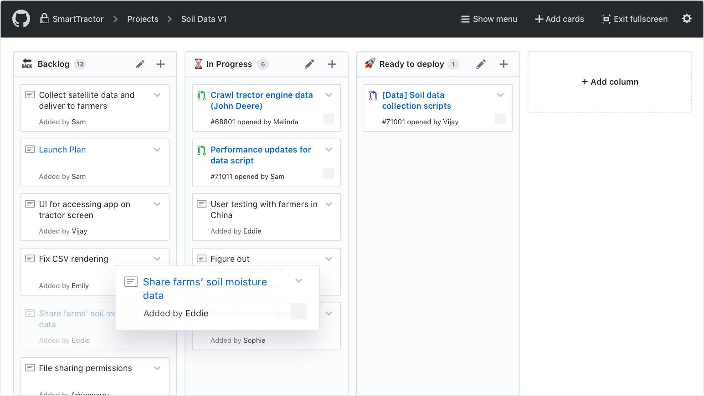

# Project Card Release Automation Presentation

### Background
* Alloy open source repo AEP Web SDK
* Use semantic versioning to release javascript files
* Running tests using Github actions
* Publish to NPM using Github actions (Adobe open source guidebook best practice)
* I wanted to see what we could do to automate releases using Github actions (CI/CD)

### Semantic Versioning
* major - incompatible API changes
* minor - add backward compatible features
* patch - add backward compatible bug fixes
* prerelease - qualifiers at the end to signify release candidates (i.e. alpha and beta)

### Problem
It's easy enough using Github actions to trigger a build and release when a PR is merged, but what version number should be used?

This is a decision that is answered manually by the development team. For example, the development team decides that the next release will be a minor release. They decide when to start releasing "alpha" versions, when to start releasing "beta" versions, and when to push the release without prerelease qualifiers.

### Solution
Github has a good deal of project management functionality. Project Boards can keep track of each release version as it progresses from "alpha", to "beta", and then to the final release.

### Demo
* Initialize "minor" version
* Move to alpha
* Merge a PR feature
* Move to beta
* Merge a PR bug fix
* Move to release
* Approve release
* [Review documentation](../README.md)

### Roadmap

1. Work with the Open Source team to publish this repo to the Adobe org.
1. Automatically extract release notes from Pull Request descriptions.
1. Allow this to be used for more than just repos with package.json.
1. Add workflows to this repo to automate deployment.
